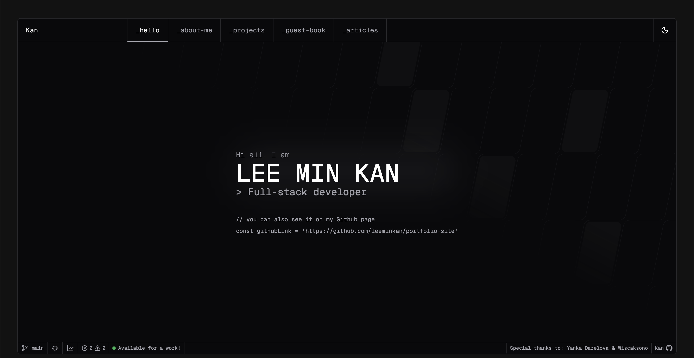
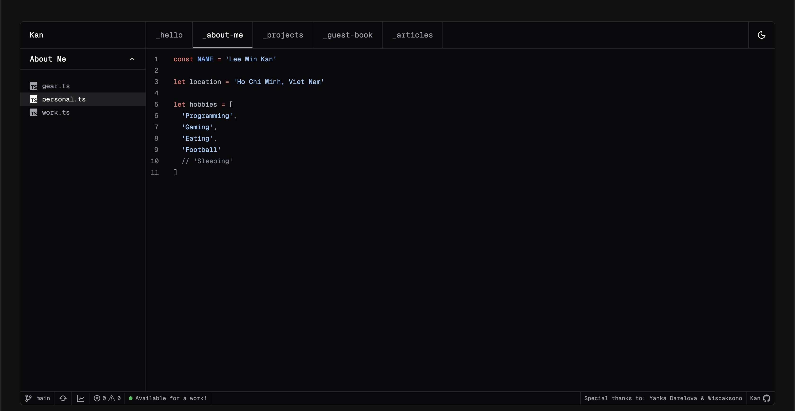

# Kan's Homepage

## Preview




## Technology Stack

- [NextJS 14 (App Router)](https://nextjs.org) - Next.js is a React framework for building full-stack web applications
- [TailwindCSS](https://tailwindcss.com) - A utility-first CSS framework packed with classes that can be composed to build any design, directly in your markup.
- [Shadcn UI](https://ui.shadcn.com/) - Beautifully designed components built with Radix UI and Tailwind CSS.
- [Next Auth](https://next-auth.js.org) - NextAuth.js is a complete open-source authentication solution for Next.js applications.
- [Prisma](https://www.prisma.io) - an open-source ORM that drastically simplifies data modeling, migrations, and data access for SQL databases in Node.js and TypeScript.

## Running Locally

This application requires Node.js v18.17+.

```bash
git clone https://github.com/leeminkan/portfolio-site
cd portfolio-site
pnpm install
pnpm dev
```

Create a .env file similar to .env.example.

## Setup umami

- https://dev.to/yehezkielgunawan/how-to-setup-and-integrate-umami-to-your-nextjs-site-ahf
- https://umami.is/docs/running-on-vercel

## Setup Github Auth App

- https://github.com/settings/applications/new
- https://mattermost.com/blog/add-google-and-github-login-to-next-js-app-with-nextauth/
